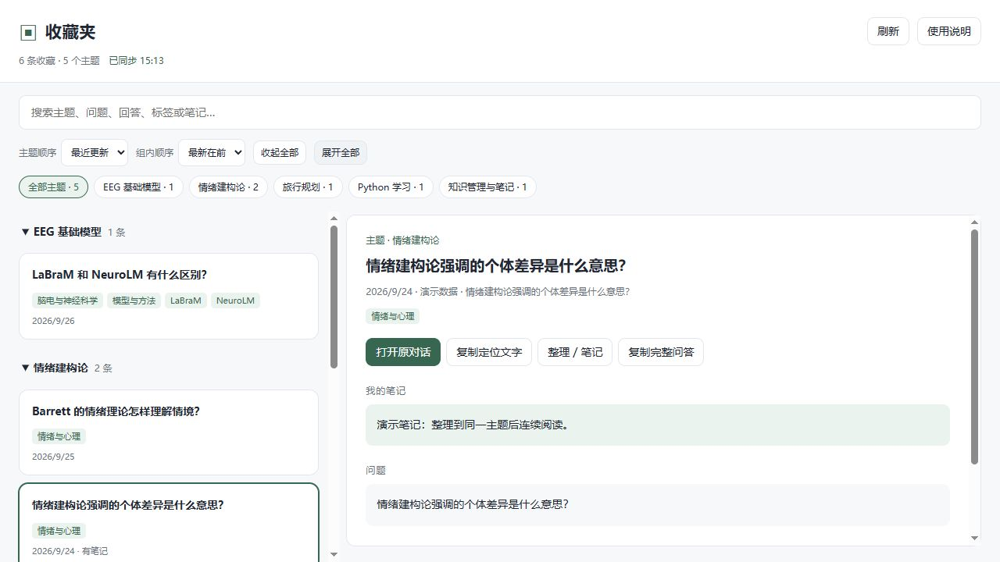
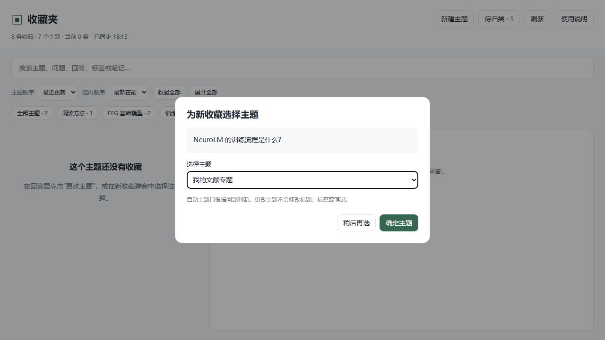

# Codex 收藏夹 · codex-bookmarks

把值得保留的 Codex 回答，集中起来阅读、搜索和整理。

[下载最新版本](https://github.com/weiweiyi332-create/codex-bookmarks/releases/latest) · [源码仓库](https://github.com/weiweiyi332-create/codex-bookmarks)

**Windows 本地工具 / Codex skill / MIT 开源 / 无第三方 Python 依赖 / 无需 API 密钥**

## 可以做什么

- 读取本机 Codex 原生问答书签，约每 10 秒同步，也可手动刷新。
- 阅读完整问题与最终回答，按本地关键词自动归类。
- **同主题集中展示**：例如“情绪建构论”相关问答归入一组，支持折叠、展开和主题筛选。
- **方便查找的排序**：默认最近有新回答的主题在前、组内最新在前；也可按主题名称、收藏数量或问题标题排序。
- 主题可手动修改、合并到已有主题；留空可恢复自动归类。原有笔记继续保留。
- 全文搜索问题、回答、标签和笔记。
- 自定义标题、标签和个人笔记；这些修改独立保存。
- 打开原对话，或复制定位文字辅助查找。

这是第三方项目，不是 OpenAI 官方功能。自动分类是关键词规则，不是大模型语义分类。



**自动主题只根据原始问题判断，不读取回答、个人笔记或自定义标题。** 若问题信息不足，会归入“其他主题”，可手动指定。

- 每条回答有独立的 **更改主题** 按钮，可选已有主题、恢复自动归类，或新建主题。
- 顶部 **新建主题** 可以先创建空主题，之后再放入收藏。
- 新收藏同步后自动弹出 **为新收藏选择主题**；可以采用自动建议、指定已有主题或现场新建。点击“稍后再选”后，可从 **待归类** 继续处理。
- 首次打开建立现有收藏基线，不为全部历史收藏连续弹窗。该弹窗发生在收藏夹同步之后，不是对 Codex 原生收藏按钮的改造。

搜索也覆盖主题名称，搜索结果会自动展开。



## 下载和安装

1. 在 GitHub Releases 下载 ZIP，或点击 **Code → Download ZIP**，解压。
2. 准备 **Python 3.10+**。在解压目录打开终端，运行：

```powershell
python install.py
```

3. 在 Codex 的下一轮对话输入：

```text
$codex-bookmarks 打开收藏夹
```

默认安装到 `~/.codex/skills/codex-bookmarks`；设置了 `CODEX_HOME` 时安装到其 skills 子目录。安装器不会覆盖已存在的目录，也不会修改 Codex 配置或注册插件。

若本机命令叫 `py`，可将上面的 `python` 换为 `py -3`。

**无需安装的备用方式**：在解压目录运行：

```powershell
python skills/codex-bookmarks/scripts/launch.py --browser
```

要显示在 Codex 右侧面板，需要当前环境提供 `open_in_codex` 工具；缺少该工具时使用普通浏览器。可选 MCP 插件资源随 skill 一起提供，安装器会生成适合本机的路径配置，但插件注册和原生入口显示没有跨客户端验证，不作为即装即用承诺。

## 兼容性与限制

- 初始目标为 **Windows 上的 Codex 桌面客户端**。原始工具曾在 OpenAI.Codex 26.928.2636.0 上读到真实收藏；发布包另做隔离安装与虚构数据验证。
- 读取未公开保证稳定的本机存储格式：`pinned-conversation-turns-v1`、`state_*.sqlite`、session JSONL。未来客户端改动可能导致不兼容。
- 需要 Codex 已产生本地记录，并在客户端添加原生书签。本工具不创建原生书签。
- 远程、云端或已缺失的记录可能无法读取；同一系统用户保存的多个账号记录可能一起显示。
- “打开原对话”目前打开整个对话，不能保证滚动到某条回答。复制定位文字后可在原对话查找。
- 不承诺插件已经显示在原生侧边栏，也不承诺支持 macOS/Linux；Windows 来源跳转使用 `os.startfile`。

## 数据与隐私

- 只读 Codex 原生书签、对话索引及问答文件；排除推理、工具输出和压缩总结。
- 本工具的 `data/annotations.json` 保存个人标题、主题选择、标签、笔记及已归类状态，`data/topics.json` 保存创建的主题和首次初始化状态，不改写原始问答。
- 服务只监听 `127.0.0.1`，使用随机访问凭据；无需向外部模型发送问答。
- 启动地址、`runtime.json`、日志和笔记属于本机数据，不要上传。关闭页面不会停止服务。
- 停止服务时根据本工具 data/runtime.json 的 PID 核对命令行属于本安装目录的 server.py 后再退出进程；本项目不创建开机启动项。

## 无真实数据演示

```powershell
python demo.py --browser
```

演示只读取项目 data 目录中的虚构记录，笔记也隔离保存。适合截图和录屏；原对话按钮没有真实目标。拍摄流程见 [视频脚本](docs/video-script.md)。

## 验证

```powershell
python -m unittest discover -s skills/codex-bookmarks/scripts -p "test_*.py"
```

更多发布包验证见 [验证记录](docs/verification.md)。遇到问题可提供 Python 与 Codex 版本、启动方式、已隐去私人内容的错误信息；不要提交真实问答、runtime.json 或数据库。

## 开发与卸载

skill 入口在 `skills/codex-bookmarks/SKILL.md`，应用在其 scripts 子目录。测试使用临时数据。从旧版本升级：先停止旧目录对应的服务，把旧技能目录移到 skills 目录之外备份，再运行新版本 install.py；将备份中的 data/annotations.json 和 data/topics.json（如果存在）复制到新技能目录的 data 文件夹，即可保留笔记、手动主题和新收藏归类状态。安装器不会覆盖旧目录。卸载前停止属于该目录的服务，再移除技能目录。若另行注册了插件，先在客户端禁用并卸载对应插件。

## 许可证

[MIT](LICENSE)。允许修改、分发和商用，需保留版权及许可证；按现状提供，不提供保证。
